# Daily Check — 5-Step Flow Report

## Executive Summary

The Daily Check feature is a comprehensive wellness tracking flow that guides users through 5 sequential steps to assess their physical exertion, pain levels, urges/cravings, coping strategies, and journal their thoughts. The flow is designed to be optional yet rewarding, with points awarded for engagement and completion.

**Entry Route:** `/check-in` (accessed from home dashboard CTA)  
**Primary Outcome:** Wellness data collection, points earning, and streak maintenance

## End-to-End Diagram

```mermaid
flowchart LR
  Start([Home Dashboard CTA])
  S1[Step 1: RPE Scale<br/>Required]
  S2[Step 2: Pain Assessment<br/>Optional]
  S3[Step 3: Urge Tracking<br/>Optional]
  S4[Step 4: Coping Strategies<br/>Optional]
  S5[Step 5: Journal Entry<br/>Optional]
  Submit([Submit & Save])
  Summary([Completion Summary])
  Home([Return to Home])
  
  Start --> S1
  S1 --> S2
  S2 -- Skip --> S3
  S2 --> S3
  S3 -- Skip --> S4
  S3 --> S4
  S4 -- Skip --> S5
  S4 --> S5
  S5 -- Skip --> Submit
  S5 --> Submit
  Submit --> Summary
  Summary --> Home
```



## Navigation & Routing

**Route Configuration:**
- **Entry Route:** `AppRoutes.checkin = '/check-in'` in `lib/routes/app_routes.dart`
- **Navigation Method:** `Navigator.pushNamed(context, AppRoutes.checkin)`
- **Exit Route:** `Navigator.pushNamedAndRemoveUntil(context, '/', (route) => false)`

**Navigation Rules:**
- **Previous:** Available on steps 2-5, uses `PageController.previousPage()`
- **Next:** Available when validation passes, uses `PageController.nextPage()`
- **Skip:** Available on steps 2-4 (not on RPE or final step), calls `_skipSection()`
- **Close:** Shows confirmation dialog, data is lost on exit

**Validation Gates:**
- **Step 1 (RPE):** Required - `_rpeValue > 0`
- **Steps 2-5:** All optional - `return true`

## Shared State & Data Model

**State Container:** Local `setState()` in `_DailyCheckInScreenState`

**Data Models:**
```dart
// Core data fields
int _rpeValue = 5;                    // 1-10 integer
double _painLevel = 0.0;              // 0-10 double
double _urgeLevel = 0.0;              // 0-10 double
List<String> _selectedCopingMechanisms = []; // Coping strategy keys
String _journalText = '';             // Free text up to 500 chars
String _selectedMood = '';            // Mood selection
List<String> _attachedPhotos = [];    // Photo file paths

// UI state
int _currentSection = 0;              // 0-4 step index
bool _isCompleted = false;            // Completion flag
bool _isSubmitting = false;           // Loading state
```

**Persistence Layer:**
- **Mock Database:** `Sb.i.from('checkins').insert()` in `_saveCheckInData()`
- **Points Service:** `PointsService.award()` for rewards
- **Analytics:** `Telemetry.logEvent()` for tracking

## Step 1 — RpeScaleWidget (`rpe_scale_widget.dart`)

**Purpose & UX Goals:**
Track user's Rate of Perceived Exertion (1-10 scale) to monitor physical recovery and effort levels.

**What it collects:**
- Integer RPE value (1-10) via slider with discrete divisions
- Color-coded feedback (green/yellow/red based on intensity)
- Descriptive text for each level

**UI Structure:**
```dart
Container(
  padding: Pad.card,
  child: Column([
    // Large RPE display with color coding
    Container(displayValue + description),
    // Slider with 9 divisions (1-10)
    SliderTheme(Slider(...)),
    // Scale markers (1, 5, 10)
    Row([Text('1'), Text('5'), Text('10')]),
    // Info note about no points awarded
    Container(info_text),
  ])
)
```

**Assets/Icons:**
- Uses `CustomIconWidget` with icon names
- Color-coded backgrounds based on RPE level

**Data & Validation:**
- **Required field:** `_rpeValue > 0` to proceed
- **Range:** 1-10 integer values
- **Storage:** Saved as integer in checkins table

**Interactions & Navigation:**
- Slider updates `_rpeValue` immediately
- Next button enabled when value > 0
- No skip option (required step)

**Responsive & A11y:**
- Fixed font sizes (48px for display value)
- Semantic labels for screen readers
- Proper contrast ratios for color coding

**Risks & Edge Cases:**
- None identified - simple slider interaction

**Acceptance Criteria:**
- ✅ User can select RPE value 1-10
- ✅ Visual feedback updates with selection
- ✅ Cannot proceed without selecting a value
- ✅ Value persists when navigating back

## Step 2 — PainLevelWidget (`pain_level_widget.dart`)

**Purpose & UX Goals:**
Assess current pain levels (0-10) with optional detailed body region mapping.

**What it collects:**
- Single pain level (0-10) via slider
- Optional body region selection (expandable)
- Visual pain scale with color coding

**UI Structure:**
```dart
Container(
  padding: Pad.card,
  child: Column([
    // Pain level display with healing icon
    Container(icon + value + description),
    // Pain slider (0-10)
    SliderTheme(Slider(...)),
    // Scale markers
    Row([Text('0'), Text('5'), Text('10')]),
    // Optional "Add details" button
    TextButton.icon('Add details'),
    // Expandable body regions (when detailed)
    if (_showDetailedView) ExpansionTile([...regions])
  ])
)
```

**Assets/Icons:**
- `CustomIconWidget` with 'healing' icon
- Body region icons: 'psychology', 'airline_seat_recline_normal', etc.
- Color-coded based on pain level (green/orange/red)

**Data & Validation:**
- **Optional field:** No validation required
- **Range:** 0-10 double values
- **Storage:** Boolean `pain: _painLevel > 0` in database

**Interactions & Navigation:**
- Slider updates `_painLevel` immediately
- "Add details" expands body region selection
- Skip button available
- Next always enabled

**Responsive & A11y:**
- Fixed heights for expandable sections
- Semantic labels for body regions
- Proper touch targets for region chips

**Risks & Edge Cases:**
- Body region selection is visual-only (not stored)
- Expansion tile may cause layout shifts

**Acceptance Criteria:**
- ✅ User can set pain level 0-10
- ✅ Optional body region details available
- ✅ Can skip without selecting anything
- ✅ Visual feedback matches pain level

## Step 3 — UrgeIntensityWidget (`urge_intensity_widget.dart`)

**Purpose & UX Goals:**
Track urges/cravings intensity (0-10) with privacy assurance and support messaging.

**What it collects:**
- Single urge level (0-10) via slider
- Automatic coping strategy pre-selection for high urges
- Privacy-focused messaging

**UI Structure:**
```dart
Container(
  padding: Pad.card,
  child: Column([
    // Privacy notice
    Container(security_icon + privacy_text),
    // Urge level display with trending icon
    Container(icon + value + description),
    // Urge slider (0-10)
    SliderTheme(Slider(...)),
    // Scale markers
    Row([Text('0'), Text('5'), Text('10')]),
    // High urge support message (if >= 7)
    if (urgeLevel >= 7) Container(support_message)
  ])
)
```

**Assets/Icons:**
- `CustomIconWidget` with 'security', 'trending_up', 'favorite' icons
- Color-coded based on urge level

**Data & Validation:**
- **Optional field:** No validation required
- **Range:** 0-10 double values
- **Auto-actions:** Pre-selects 'scripture' and 'breathing' coping strategies if urge >= 7 and faith mode enabled
- **Storage:** Integer `urge: _urgeLevel.round()` in database

**Interactions & Navigation:**
- Slider updates `_urgeLevel` immediately
- High urge triggers coping strategy pre-selection
- Skip button available
- Next always enabled

**Responsive & A11y:**
- Privacy messaging prominently displayed
- Support message appears for high urges
- Consistent with other slider patterns

**Risks & Edge Cases:**
- High urge auto-selection may confuse users
- Privacy messaging could be overwhelming

**Acceptance Criteria:**
- ✅ User can set urge level 0-10
- ✅ Privacy message is visible
- ✅ High urges show support message
- ✅ Can skip without selecting anything
- ✅ Auto-selects coping strategies for high urges

## Step 4 — CopingMechanismsWidget (`coping_mechanisms_widget.dart`)

**Purpose & UX Goals:**
Select coping strategies that helped during the day, with visual cards and points display.

**What it collects:**
- Multiple coping strategy selections
- Visual feedback with points calculation
- Strategy descriptions and images

**UI Structure:**
```dart
Column([
  // Selection summary bar (if selections > 0)
  if (selectedCount > 0) Container(summary_bar),
  // Coping strategies list
  Expanded(
    ListView.builder([
      CopingTile(
        // Strategy card with image, title, description, points
        // Selection indicator
      )
    ])
  )
])
```

**Assets/Icons:**
- **12 coping strategy images:** `assets/images/coping/` (PNG + WebP)
  - scripture.png, exercise.png, journaling.png, music.png
  - call_friend.png, walk.png, gratitude.png, creative.png
  - mindful_eating.png, cold_shower.png, breathing.png, pray.png
- Each strategy has 80x48px thumbnail
- Selection indicators with check icons

**Data & Validation:**
- **Optional field:** No validation required
- **Selection:** Multiple selections allowed
- **Points:** +5 points per selected strategy (max +25 total)
- **Storage:** Boolean `coping_done: _selectedMechanisms.isNotEmpty`

**Interactions & Navigation:**
- Tap strategy cards to toggle selection
- Selection count and points displayed in header
- Skip button available
- Next always enabled

**Responsive & A11y:**
- Fixed card dimensions (80x48px thumbnails)
- Semantic labels for each strategy
- Proper touch targets for cards
- Error handling for missing images

**Risks & Edge Cases:**
- Image loading failures show fallback icon
- Long strategy lists may cause scrolling issues
- Points calculation could be confusing

**Acceptance Criteria:**
- ✅ User can select multiple coping strategies
- ✅ Visual feedback shows selections and points
- ✅ Images load properly with fallbacks
- ✅ Can skip without selecting anything
- ✅ Points calculation is accurate

## Step 5 — JournalEntryWidget (`journal_entry_widget.dart`)

**Purpose & UX Goals:**
Capture daily reflections with mood selection, text input, and optional photo attachments.

**What it collects:**
- Mood selection from 8 predefined options
- Free-text journal entry (up to 500 characters)
- Optional photo attachments (camera/gallery)
- Character count with bonus points indicator

**UI Structure:**
```dart
Container(
  padding: Pad.card,
  child: Column([
    // Points indicator (if qualifying)
    if (journalPoints > 0) Container(points_badge),
    // Mood selection chips
    SizedBox(height: 64, ListView.horizontal([mood_chips])),
    // Journal text input
    Row([title, character_counter]),
    TextField(maxLines: 6, maxLength: 500),
    // Photo attachments
    Row([title, TextButton.icon('Add Photo')]),
    if (photos.isNotEmpty) SizedBox(height: 60, ListView.horizontal([photos])),
    // Bonus points explanation
    if (characterCount < 120) Container(info_text)
  ])
)
```

**Assets/Icons:**
- **8 mood icons:** 'favorite', 'self_improvement', 'bolt', 'wb_sunny', 'psychology', 'fitness_center', 'sentiment_satisfied', 'sentiment_dissatisfied'
- **Photo actions:** 'camera_alt', 'photo_library', 'add_a_photo', 'close'
- **Points indicator:** 'stars' icon with gold styling

**Data & Validation:**
- **Optional field:** No validation required
- **Character limit:** 500 characters max
- **Bonus points:** +10 points if text >= 120 characters (only if no coping bonus)
- **Photo limit:** No explicit limit, stored as file paths
- **Storage:** Text stored as `journal_text` string

**Interactions & Navigation:**
- Mood chips toggle selection
- Text input with real-time character counting
- Photo picker with camera/gallery options
- Skip button available
- Next always enabled

**Responsive & A11y:**
- Fixed heights for horizontal lists (64px, 60px)
- Proper text field sizing and scrolling
- Photo thumbnails with remove buttons
- Permission handling for camera access

**Risks & Edge Cases:**
- Camera permission denied
- Photo storage and cleanup
- Text input performance with large text
- Character count accuracy

**Acceptance Criteria:**
- ✅ User can select mood from chips
- ✅ Text input works with character counter
- ✅ Photo attachment works (camera/gallery)
- ✅ Bonus points indicator shows correctly
- ✅ Can skip without entering anything
- ✅ Character limit enforced at 500

## Points/Rewards Calculation

**Per-Step Contributions:**
- **Step 1 (RPE):** 0 points (tracking only)
- **Step 2 (Pain):** 0 points (tracking only)
- **Step 3 (Urge):** 0 points (tracking only)
- **Step 4 (Coping):** +25 points maximum (if any strategies selected)
- **Step 5 (Journal):** +10 points (if text >= 120 chars AND no coping bonus)

**Points Logic:**
```dart
int _calculatePointsEarned() {
  int totalPoints = 0;
  bool copingDone = _selectedCopingMechanisms.isNotEmpty;
  
  if (copingDone) {
    totalPoints += 25; // Cap at 25 for coping
  } else if (_journalText.trim().length >= 120) {
    totalPoints += 10; // Journal bonus only if no coping
  }
  
  return totalPoints;
}
```

**Storage & Display:**
- Points awarded via `PointsService.award()`
- Stored in `actions` table with user_id, action, value, note
- Mirrored to user's total points via RPC `set_points_floor_zero`
- Displayed in completion summary modal

**Streak Integration:**
- Completion triggers `Streaks.maybeAward7()` for 7-day streak bonus (+50 points)
- Streak calculation based on consecutive daily check-ins
- Idempotent streak awards (prevents duplicate bonuses)

## End-to-End Data Flow


## Known Gaps & Risks

**Missing Validations:**
- No offline data persistence (data lost on app restart)
- No duplicate submission prevention
- No data validation on submit (could submit empty check-ins)

**Race Conditions:**
- Concurrent point awards could cause inconsistencies
- Streak calculation timing issues
- Photo upload failures not handled gracefully

**Unreachable States:**
- High urge auto-selection might confuse users
- Completion modal is non-dismissible (could trap users)
- No way to edit previous steps after completion

**Unhandled Errors:**
- Network failures during submission
- Database connection issues
- Camera permission denied scenarios
- Image processing failures

**UX Issues:**
- No progress saving during flow
- Exit confirmation doesn't save partial progress
- Completion summary blocks all interaction
- No way to view/edit submitted data

## Recommendations

**UX/Layout Fixes:**
- Implement auto-save for partial progress
- Add max width constraints for tablet/desktop views
- Fix bottom navigation overlap with content
- Make completion modal dismissible with confirmation

**Tokenization & Consistency:**
- Replace all hardcoded font sizes with design tokens
- Remove percentage-based sizing in favor of fixed values
- Standardize spacing using `AppSpace` constants
- Create consistent color scheme usage

**Asset Management:**
- Implement proper image loading with caching
- Add fallback images for all coping strategies
- Optimize image formats (WebP with PNG fallbacks)
- Add image compression for photo attachments

**Navigation & Validation:**
- Add data validation before submission
- Implement duplicate submission prevention
- Add offline mode with sync capability
- Create edit mode for completed check-ins

**Testing & Monitoring:**
- Add unit tests for points calculation logic
- Create widget tests for each step component
- Implement analytics for flow abandonment points
- Add error tracking for submission failures

**Performance:**
- Implement lazy loading for coping strategy images
- Add debouncing for text input character counting
- Optimize photo processing and storage
- Cache user data to reduce API calls

---

**Report Generated:** $(date)  
**Codebase Version:** Current branch `chore/refactor-ui-tokens`  
**Total Files Analyzed:** 12 files across daily check-in feature
