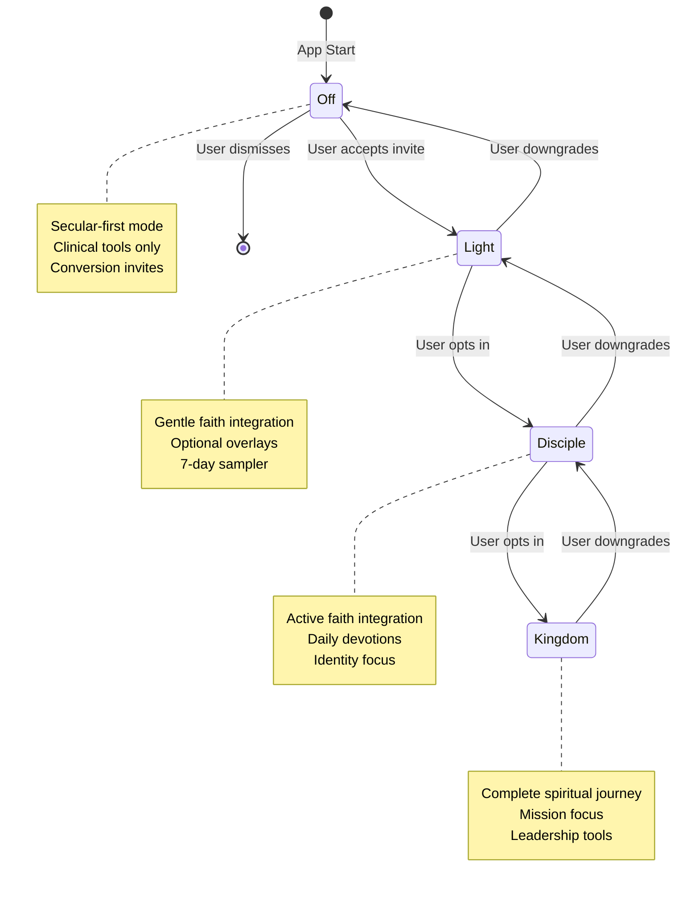

# Mind Coach Specification

**Version:** 1.0  
**Date:** October 2024  
**Flutter:** 3.35.6 (Dart 3.9.2)  
**Theme:** Midnight Minimal / Frame.io-inspired  
**Global Width:** 430px clamp  
**Text Scaler:** 1.0  

## 1. Executive Summary

### Purpose
The Mind Coach is a dual-mode mental wellness system that provides evidence-based cognitive behavioral tools while maintaining a clear evangelistic telos: guiding users toward Jesus Christ as their True North for ultimate healing and purpose.

### Dual-Mode Intent
- **Faith OFF (Secular-first)**: Delivers clinical-grade CBT/MI/ACT interventions without religious content, building trust and demonstrating effectiveness
- **Faith Activated**: Same clinical foundation enhanced with optional KJV scripture, prayer, and identity-in-Christ overlays, respecting user consent at every step

### Key Outcomes
- **Behavior Change**: Improved emotional regulation, thought patterns, and coping strategies
- **Resilience**: Enhanced crisis management and long-term mental wellness
- **Conversion**: Respectful invitation to explore Faith Mode through natural progression points
- **Retention**: Higher engagement through personalized, faith-integrated experiences

### Success Metrics
- 15%+ OFF→Light conversion rate within 30 days
- 25%+ D7 retention uplift post-activation
- 80%+ exercise completion rate
- 90%+ user satisfaction with consent model

## 2. Product Principles

### Clinical Excellence
- Evidence-based interventions (CBT, MI, ACT) in both modes
- Licensed therapist review of all therapeutic content via Clinical Review Board
- Crisis intervention protocols and emergency resource links
- Privacy-by-design with minimal data collection
- Minimum age policy: 13+ with parental consent for minors
- Self-help/coaching only; no diagnosis or treatment; crisis is refer-out.

### Transparent Telos
- We openly state our belief that deepest healing is found in Jesus Christ while delivering fully useful secular tools. Faith overlays are optional and consent-driven.
- Clear value proposition: "Order, truth, and responsibility change your life. We believe their deepest end is found in Jesus Christ."
- No hidden agendas or bait-and-switch tactics

### Respectful Consent
- Multiple doors, same destination approach
- Always provide "Keep Secular Tools" option
- Rate-limited invitations (max 1/day, 7-day snooze)
- User control over faith overlay visibility

### Progressive Revelation
- Small steps → responsibility → meaning ("aim up")
- Natural progression from practical tools to spiritual depth
- Identity-based reframes that point toward Christ
- Service-oriented goal setting

### NEW: Content Governance
- Clinical Review Board: Licensed therapist sign-off for all therapeutic content
- Theology Review Board: Doctrinal accuracy and KJV excerpt validation (≤2 sentences)
- Content Governance SOP with SLAs: 48h hotfix, 7d minor updates (SLAs apply when an external advisor is engaged)
- Risk levels and sign-off templates for quality assurance

### NEW: Truth Axis Integration
- TruthService: Maps secular concepts to biblical roots across all app branches
- Creed Integration: Two Powers framework (Light vs Darkness) with KJV verses ≤2 sentences
- Per-Branch Placements: Home callout, Mind reframe success, Body habit footer, Spirit creed, Rewards light streak
- Consent-First: All faith overlays optional with user control and rate-limited invitations

### NEW: Crisis & Safety Posture
- Geo-aware crisis resources (US 988, international lookups)
- Always-visible Help link in Coach interface
- Minimum age policy: 13+ with parental consent pathway
- Crisis incident monitoring per DAU for safety gating

## 3. System Overview

### 3.1 High-Level Data Flow

```mermaid
flowchart TD
    UI[Mind Screen] --> Coach[Mind Coach Layer]
    Coach --> Repo[MindCoachRepository]
    Repo --> Assets[(assets/mind/*.json)]
    Coach --> Settings[AppSettings (FaithMode,...)]
    Coach --> Analytics[Events/KPIs]
    Coach --> Courses[CourseRepository]
    Courses --> CourseJson[(assets/courses/*.json)]
    
    Coach --> Conversion[ConversionFunnelService]
    Conversion --> Invites[MeaningHorizonCard]
    Conversion --> Modal[SwitchToFaithModeDialog]
    
    Settings --> Persistence[(SharedPreferences)]
    Analytics --> Tracking[Event Tracking]
    
    style UI fill:#1a1a1a,stroke:#3c79ff,color:#fff
    style Coach fill:#2a2a2a,stroke:#3c79ff,color:#fff
    style Assets fill:#1a1a1a,stroke:#3c79ff,color:#fff
    style Settings fill:#2a2a2a,stroke:#3c79ff,color:#fff
```

### 3.2 Mode Gating & Invitations



## 4. Faith Modes & Settings

### FaithMode Enum
```dart
enum FaithMode { 
  off,           // Secular-first, clinical tools only
  light,         // Gentle faith integration, optional overlays
  disciple,      // Active faith integration, daily devotions
  kingdomBuilder // Complete spiritual journey, mission focus
}

extension FaithFlags on FaithMode {
  bool get isOff => this == FaithMode.off;
  bool get isActivated => this != FaithMode.off;
  bool get isDeep => this == FaithMode.disciple || this == FaithMode.kingdomBuilder;
}
```

### AppSettings Keys

| Key | Type | Default | Description | Notes |
|-----|------|---------|-------------|-------|
| `faith_mode` | String | `"off"` | Current faith tier | Values: `off`, `light`, `disciple`, `kingdomBuilder` |
| `hide_faith_overlays_in_mind` | Bool | `false` | Lets Activated users keep Mind clinical | Respect user choice |
| `coach_voice_speed` | String | `"neutral"` | Coach interaction pace | Values: `calm`, `neutral`, `energetic` |
| `nudge_frequency` | String | `"med"` | How often to show nudges | Values: `low`, `med`, `high` |
| `daily_reminders_enabled` | Bool | `true` | Coach reminders | Respect OS DND |
| `privacy_strict_mode` | Bool | `false` | Restrict analytics granularity | See Privacy section |
| `last_invite_shown` | String | `null` | ISO timestamp of last conversion invite | Rate limiting |
| `invite_snooze_until` | String | `null` | ISO timestamp when invites can resume | 7-day snooze |
| `conversion_signals` | Map | `{}` | Track completion/urge/values signals | Analytics |

### Persistence Pattern
- **Primary**: SharedPreferences (web/desktop compatible)
- **Future**: Cloud sync with user consent
- **Migration**: Versioned schema with backward compatibility
- **Security**: No sensitive data in plain text

### NEW: Enum Persistence & Timestamps
```dart
// Avoid toString() - use enum.name for persistence
String _enumName(FaithMode m) => m.name; // Dart 2.15+
FaithMode _enumFrom(String? v) =>
  FaithMode.values.firstWhere((e) => e.name == (v ?? 'off'), orElse: () => FaithMode.off);

// Store UTC timestamps for consistency
Future<void> _setLastInvite(DateTime t) async =>
  prefs.setString('last_invite_shown', t.toUtc().toIso8601String());

// Monotonic rate-limiting for long sessions
final _clock = Stopwatch()..start();
// require _clock.elapsed > const Duration(hours:24) for in-session re-invites
```

## 5. Assets & Content Contracts

### Asset Structure
```
assets/
├── mind/
│   ├── coach_prompts.json          # Core coach content
│   ├── week_completion_invites.json # Conversion copy
│   └── faith_mode_modal.json       # Modal content
└── courses/
    ├── mind_aim_up_8w.json         # Dual-mode course
    ├── light_onramp_7d.json        # 7-day sampler
    └── discipleship_12w.json       # Deep faith course
```

### Coach Prompts Schema
```json
{
  "version": 1,
  "coach": {
    "off": {
      "greeting": "I'm your Mind Coach. We'll use evidence-based tools to steady your thoughts.",
      "reframeIntro": "Let's catch the thought, test the evidence, and craft a balanced reframe.",
      "nudgeSmallStep": "What's one tiny step you can take in the next 10 minutes?",
      "quickReplies": [
        "Help me reframe this thought",
        "I need a small step",
        "Show me breathing exercises",
        "What's my next move?"
      ],
      "quotes": [
        "Between stimulus and response there is a space. In that space is our power to choose our response. — Viktor Frankl",
        "We are what we repeatedly do. Excellence, then, is not an act, but a habit. — Will Durant"
      ]
    },
    "activated": {
      "greeting": "I'm your Mind Coach. We'll steady your thoughts and, if you wish, invite God into the process.",
      "reframeIntro": "Let's test the thought against truth and craft a faith-filled, balanced reframe.",
      "nudgeSmallStep": "What's one faithful step you can take in the next 10 minutes?",
      "faithOptional": "Would you like a short verse or prayer added?",
      "quickReplies": [
        "Help me reframe this thought",
        "I need a small step",
        "Show me breathing exercises",
        "What's my next move?",
        "Add a verse for strength",
        "Pray with me briefly"
      ],
      "scriptureKJV": [
        {
          "ref": "Philippians 4:6-7",
          "text": "Be careful for nothing; but in every thing by prayer and supplication with thanksgiving let your requests be made known unto God. And the peace of God, which passeth all understanding, shall keep your hearts and minds through Christ Jesus."
        },
        {
          "ref": "Romans 12:2",
          "text": "And be not conformed to this world: but be ye transformed by the renewing of your mind, that ye may prove what is that good, and acceptable, and perfect, will of God."
        }
      ]
    }
  }
}
```

### Course Week Schema (Mind Aim Up)
```json
{
  "id": 1,
  "slug": "order-before-mission",
  "title": "Order Before Mission",
  "summary": "Build micro-order to restore agency and create space for purpose.",
  "objectives": [
    "Complete one micro-task daily",
    "Identify your core values",
    "Create a simple morning routine"
  ],
  "exercise": {
    "id": "thought_record",
    "off": {
      "intro": "Capture the situation, automatic thought, emotion, and evidence. Then reframe.",
      "steps": [
        "Describe the triggering situation",
        "Identify your automatic thought",
        "Rate your emotional intensity (1-10)",
        "List evidence for and against the thought",
        "Write a balanced alternative"
      ]
    },
    "activated": {
      "intro": "Capture the situation, automatic thought, emotion, and evidence. Then reframe with God's truth.",
      "offerings": [
        "Add a verse for strength",
        "Include an identity statement",
        "End with a brief prayer"
      ]
    }
  },
  "challenge": {
    "off": "Complete one micro-task each day this week. Start with something you can do in 2 minutes.",
    "activated": "Complete one micro-task each day this week, offering it to God as an act of worship."
  },
  "reflectionPrompts": [
    "What micro-task gave you the most satisfaction?",
    "How did completing small tasks affect your sense of agency?",
    "What would you like to build on next week?"
  ],
  "faithOverlay": {
    "light": {
      "prompt": "Consider how order reflects God's character. What does this teach you about His nature?",
      "requiresConsent": true,
      "scriptureKJV": [
        {
          "ref": "1 Corinthians 14:40",
          "text": "Let all things be done decently and in order."
        }
      ]
    },
    "disciple": {
      "identity": "You are a steward of God's creation, called to bring order and beauty to your corner of the world.",
      "requiresConsent": false,
      "scriptureKJV": [
        {
          "ref": "Genesis 1:28",
          "text": "And God blessed them, and God said unto them, Be fruitful, and multiply, and replenish the earth, and subdue it."
        }
      ]
    },
    "kingdomBuilder": {
      "commission": "Your daily order is training for kingdom leadership. How can you help others find their rhythm?",
      "requiresConsent": false,
      "scriptureKJV": [
        {
          "ref": "Luke 16:10",
          "text": "He that is faithful in that which is least is faithful also in much."
        }
      ]
    }
  },
  "overlayContract": {
    "maxVerseSentences": 2,
    "allowPrayer": true,
    "prayerMaxWords": 40,
    "kvyOnly": true
  },
  "offModeExitInvite": {
    "headline": "Order is a beginning, not the end.",
    "body": "Micro-order restores agency. We believe the deepest peace behind order is found in Jesus Christ.",
    "primaryCta": {
      "label": "Explore Faith Mode",
      "action": "activate_light"
    },
    "secondaryCta": {
      "label": "Keep Secular Tools",
      "action": "dismiss"
    },
    "conversionSignals": {
      "minCompletionsThisWeek": 3,
      "showAtUrgeResolved": true
    }
  },
  "xp": 120
}
```

## 6. Mind Coach Functional Surface

**Scope Disclaimer**: Mind Coach provides self-help coaching, not medical care. If you're in crisis, call 988 (US) or local emergency services.

### Coach Tab
- **Greeting**: Mode-aware welcome message
- **Reframe Prompts**: Interactive thought challenging exercises
- **Quick Actions**: One-tap access to common tools
- **Micro-nudges**: Contextual encouragement and next steps
- **Daily Inspiration**: Mode-appropriate quotes or scripture
- **Reframe Success**: TruthService integration - "Aligned to truth" (OFF) / "Aligned to Christ's truth — John 14:6" (Activated)

### Exercises Tab
Core tools available in both modes:

1. **Thought Record**: Capture and reframe automatic thoughts
2. **Reframe Builder**: Structured cognitive restructuring
3. **Box Breathing**: 4-4-4-4 pattern with optional meditation
4. **Values Clarification**: Identify core values and alignment
5. **Implementation Intention**: "If-then" planning for obstacles
6. **Exposure Ladder**: Gradual anxiety reduction
7. **Commitment Contract**: Behavioral change agreements
8. **Joy Audit**: Gratitude and positive emotion tracking
9. **Relapse Plan**: Crisis prevention and recovery strategies

### Courses Tab
- **Cognitive Foundations (8w)**: Always visible, secular-first approach
- **Mind — Aim Up (8w)**: Dual-mode course with faith overlays
- **Discipleship — 12w**: Visible only when Faith Activated, deep-links to Spirit screen

### Mode Pill
- **OFF**: "Mode: Secular-first" (gray)
- **Activated**: "Mode: Faith-activated" (primary blue)

## 7. UI/UX Specifications

### Components

#### CoachingCard
```dart
class CoachingCard extends StatelessWidget {
  final String title;
  final String content;
  final List<QuickAction> actions;
  final FaithMode faithMode;
  final bool showFaithOptional;
}
```

#### CoursesList
```dart
class CoursesList extends StatelessWidget {
  final List<CourseTile> courses;
  final FaithMode faithMode;
  final VoidCallback? onCourseTap;
}
```

#### MeaningHorizonCard
```dart
class MeaningHorizonCard extends StatelessWidget {
  final String headline;
  final String body;
  final VoidCallback? onKeepSecular;
  final VoidCallback? onExploreFaith;
}
```

#### SwitchToFaithModeDialog
```dart
class SwitchToFaithModeDialog extends StatelessWidget {
  final VoidCallback? onActivateLight;
  final VoidCallback? onLearnMore;
  final VoidCallback? onNotNow;
}
```

### Motion & Interaction
- **Animation Duration**: 120-200ms ease-out
- **Touch Targets**: Minimum 44×44px
- **Text Scaling**: Locked at 1.0 (no user scaling)
- **Haptic Feedback**: Subtle on button taps
- **Loading States**: Skeleton screens for content loading

### Copy Length Guidelines
- **Headlines**: ≤ 40 characters for 430px width
- **Body Text**: ≤ 120 characters per paragraph
- **CTAs**: ≤ 20 characters
- **Scripture**: ≤ 2 sentences (KJV only)

### NEW: Onboarding Transparency
**Two Modes Explainer Screen** (first run, no walls):
- "You can use the Mind Coach in Secular-first mode. We believe deepest healing is found in Jesus—Faith Mode adds optional verses/prayer. You can change this anytime."
- Single screen, no blocking walls
- Clear mode selection with preview

### NEW: Meaning Horizon Refinements
- Show once per eligible context, then snooze silently for 7 days
- Add micro-testimony variant (≤25 words) A/B test: "I felt less anxious praying this verse before bed."
- User-generated testimonials (future roadmap)

### NEW: Empty & Error States
- **Missing Assets**: "I'll keep it simple today. Want a small, 2-minute step?"
- **Network Issues**: Graceful degradation with cached content
- **Loading States**: Skeleton screens for all async operations

### NEW: Accessibility Requirements
- **Semantics Labels**: Mode pill and all dual-CTA buttons
- **Focus Order**: meaning card → Explore → Keep Secular → close
- **Screen Reader**: All actionable elements properly labeled
- **High Contrast**: WCAG AA compliance on dark theme

### Faith OFF End-of-Week Flow
1. Show completion celebration
2. Display MeaningHorizonCard with clear dual CTAs
3. Primary: "Explore Faith Mode" → SwitchToFaithModeDialog
4. Secondary: "Keep Secular Tools" → return to Mind home
5. Respect user choice with appropriate feedback

## 8. Consent & Brand Rules

### OFF Mode Rules
- **Never** auto-insert religious content
- **Never** show scripture without explicit request
- **Always** provide secular alternatives
- **Always** respect user's secular preference

### NEW: Light Mode Rules (with requiresConsent flag)
- **Ask permission** for verse/prayer overlays each session (requiresConsent: true)
- **Save choice** for session only (reset next session)
- **Provide toggle** to hide faith overlays in Mind
- **Default to secular** with gentle faith options
- **Consent-based overlays** only show when user explicitly agrees

### Disciple/Kingdom Builder Rules
- **Overlays on by default** but always optional
- **Provide toggle** "hide faith overlays in Mind"
- **Respect user choice** immediately when toggled
- **Maintain clinical quality** regardless of overlay state

### Brand Voice Guidelines
- **Encouraging**: Focus on growth and possibility
- **Responsible**: Acknowledge difficulty and provide tools
- **Actionable**: Always include concrete next steps
- **Respectful**: Honor user's current beliefs and journey
- **Transparent**: Be clear about faith integration when present

## 9. Conversion Mechanics (OFF → Activated)

### Conversion Triggers
1. **Week Completion**: ≥3 completions in current week
2. **Crisis Resolution**: Urge score ≥7 successfully resolved
3. **Values Milestone**: User selects service/legacy/sacrifice values
4. **Engagement Threshold**: High usage patterns over 7 days

### CTA Path
```
User Action → ConversionFunnelService.checkEligibility() 
→ MeaningHorizonCard → SwitchToFaithModeDialog 
→ setFaithMode(FaithMode.light) → Optional auto-enroll light_onramp_7d
```

### Rate Limiting
- **Maximum**: 1 invite per day
- **Snooze**: 7 days on "Not now"
- **Reset**: Weekly completion counter resets Sundays
- **Respect**: User can permanently opt out

### NEW: Dependency Injection Pattern
```dart
class ConversionFunnelService {
  ConversionFunnelService(this.storage, this.clock, this.signals);
  final InviteStorage storage;
  final Clock clock; // exposes nowUtc()
  final SignalsProvider signals;
  
  bool shouldShowInvite(FaithMode currentMode) {
    if (!currentMode.isOff) return false;
    if (storage.isRateLimited(clock.nowUtc())) return false;
    if (storage.isSnoozed(clock.nowUtc())) return false;
    return signals.hasConversionSignals();
  }
}

// Graceful asset loading
Future<Map<String, dynamic>> _loadJson(String path) async {
  try { 
    return json.decode(await rootBundle.loadString(path)); 
  } catch (_) { 
    return {"version":1,"coach":{"off":{}, "activated":{}}}; 
  }
}
```

### Analytics Integration
```dart
// Track conversion events
Analytics.track('invite_shown', {
  'context': inviteContext.toString(),
  'signals': _getConversionSignals(),
  'time_since_last': _timeSinceLastInvite,
});

Analytics.track('invite_accepted', {
  'context': inviteContext.toString(),
  'conversion_path': 'meaning_horizon_card',
  'time_to_decision': _timeToDecision,
});
```

## 10. Data Models & Interfaces

### AppSettings (ChangeNotifier)
```dart
class AppSettings extends ChangeNotifier {
  FaithMode _faithMode = FaithMode.off;
  bool _hideFaithOverlaysInMind = false;
  String _coachVoiceSpeed = 'neutral';
  String _nudgeFrequency = 'med';
  bool _dailyRemindersEnabled = true;
  bool _privacyStrictMode = false;
  DateTime? _lastInviteShown;
  DateTime? _inviteSnoozeUntil;
  Map<String, dynamic> _conversionSignals = {};
  
  // Getters
  FaithMode get faithMode => _faithMode;
  bool get hideFaithOverlaysInMind => _hideFaithOverlaysInMind;
  
  // Setters with persistence
  Future<void> setFaithMode(FaithMode mode) async {
    _faithMode = mode;
    await _persist();
    notifyListeners();
  }
  
  Future<void> setHideFaithOverlays(bool hide) async {
    _hideFaithOverlaysInMind = hide;
    await _persist();
    notifyListeners();
  }
  
  // Persistence
  Future<void> _persist() async {
    final prefs = await SharedPreferences.getInstance();
    await prefs.setString('faith_mode', _faithMode.toString());
    await prefs.setBool('hide_faith_overlays_in_mind', _hideFaithOverlaysInMind);
    // ... other fields
  }
}
```

### MindCoachRepository
```dart
class MindCoachRepository {
  static const String _coachPromptsPath = 'assets/mind/coach_prompts.json';
  Map<String, dynamic>? _coachData;
  
  Future<void> loadData() async {
    try {
      final String response = await rootBundle.loadString(_coachPromptsPath);
      _coachData = json.decode(response);
    } catch (e) {
      debugPrint('Error loading coach prompts: $e');
      _coachData = null;
    }
  }
  
  MindCoachCopy getCoachCopy(FaithMode mode) {
    if (_coachData == null) {
      return MindCoachCopy.copyFor(mode);
    }
    
    final Map<String, dynamic>? modeData = 
        _coachData!['coach'][mode.isOff ? 'off' : 'activated'];
    
    if (modeData == null) {
      return MindCoachCopy.copyFor(mode);
    }
    
    return MindCoachCopy(
      greeting: modeData['greeting'] ?? '',
      reframeIntro: modeData['reframeIntro'] ?? '',
      nudgeSmallStep: modeData['nudgeSmallStep'] ?? '',
      faithOptional: modeData['faithOptional'],
      quickReplies: (modeData['quickReplies'] as List?)?.cast<String>() ?? [],
      quotes: (modeData['quotes'] as List?)?.cast<String>() ?? [],
      scriptureKJV: mode.isActivated ? 
        (modeData['scriptureKJV'] as List?)?.cast<Map<String, String>>() ?? [] : [],
    );
  }
}
```

### CourseRepository + CourseWeek Model
```dart
class CourseWeek {
  final int id;
  final String slug;
  final String title;
  final String summary;
  final List<String> objectives;
  final ExerciseContent exercise;
  final Map<String, String> challenge;
  final List<String> reflectionPrompts;
  final Map<String, FaithOverlay> faithOverlay;
  final OffModeExitInvite? offModeExitInvite;
  final int xp;
  
  const CourseWeek({
    required this.id,
    required this.slug,
    required this.title,
    required this.summary,
    required this.objectives,
    required this.exercise,
    required this.challenge,
    required this.reflectionPrompts,
    required this.faithOverlay,
    this.offModeExitInvite,
    required this.xp,
  });
}

class CourseRepository {
  Future<List<CourseWeek>> getCourseWeeks(String courseId) async {
    // Load and parse course JSON
    // Return list of CourseWeek objects
  }
  
  Future<CourseWeek?> getWeek(String courseId, int weekId) async {
    // Load specific week
  }
}
```

### InviteService
```dart
class InviteService {
  static bool checkEligibility(FaithMode currentMode, Map<String, dynamic> signals) {
    if (!currentMode.isOff) return false;
    
    // Rate limiting
    if (_isRateLimited()) return false;
    
    // Signal checking
    return _hasConversionSignals(signals);
  }
  
  static bool _isRateLimited() {
    // Check last invite time and snooze status
  }
  
  static bool _hasConversionSignals(Map<String, dynamic> signals) {
    return signals['completionsThisWeek'] >= 3 ||
           signals['lastUrgeScore'] >= 7 ||
           _hasServiceValues(signals['valuesChosen']);
  }
}
```

### Analytics Interface
```dart
abstract class AnalyticsService {
  void track(String eventName, Map<String, dynamic> properties);
  void setUserProperty(String key, dynamic value);
  void setUserId(String userId);
}

class MindCoachAnalytics {
  static void trackCoachOpened(FaithMode mode) {
    Analytics.track('coach_opened', {'faith_mode': mode.toString()});
  }
  
  static void trackQuickReplyUsed(String reply, FaithMode mode) {
    Analytics.track('quick_reply_used', {
      'reply': reply,
      'faith_mode': mode.toString(),
    });
  }
  
  static void trackVerseRequested(String reference, FaithMode mode) {
    Analytics.track('verse_requested', {
      'reference': reference,
      'faith_mode': mode.toString(),
    });
  }
  
  static void trackInviteShown(String context, Map<String, dynamic> signals) {
    Analytics.track('invite_shown', {
      'context': context,
      'signals': signals,
    });
  }
  
  static void trackInviteAccepted(String context, String conversionPath) {
    Analytics.track('invite_accepted', {
      'context': context,
      'conversion_path': conversionPath,
    });
  }
}
```

## 11. Instrumentation & KPIs

### NEW: Tracking Plan
| Property | Type | Values | Purpose |
|----------|------|--------|---------|
| `faith_mode` | enum | `off`, `light`, `disciple`, `kingdomBuilder` | Mode tracking |
| `invite_context` | enum | `week_complete`, `urge_resolved`, `values`, `usage` | Conversion context |
| `signals` | object | `{completionsThisWeek:int, lastUrge:int, values:[string]}` | Conversion signals |
| `overlay_used` | enum | `verse`, `prayer`, `identity`, `null` | Faith overlay usage |
| `exp` | string | `meaning_horizon_v2`, `micro_testimony_v1` | Experiment tracking |

### Events
| Event | Properties | Purpose |
|-------|------------|---------|
| `coach_opened` | `faith_mode`, `session_id`, `exp` | Track engagement |
| `quick_reply_used` | `reply`, `faith_mode`, `exp` | Measure tool usage |
| `verse_requested` | `reference`, `faith_mode`, `overlay_used` | Track faith engagement |
| `prayer_requested` | `context`, `faith_mode`, `overlay_used` | Measure prayer usage |
| `invite_shown` | `invite_context`, `signals`, `exp` | Conversion funnel |
| `invite_accepted` | `invite_context`, `conversion_path`, `exp` | Conversion success |
| `faith_mode_changed` | `from_mode`, `to_mode` | Mode transitions |
| `week_completed` | `course_id`, `week_id`, `faith_mode` | Course progress |
| `urge_resolved` | `initial_score`, `final_score`, `method` | Crisis management |
| `onramp_started` | `user_id` | Light sampler engagement |
| `onramp_completed` | `user_id`, `days_completed` | Light sampler success |

### NEW: Telemetry Modes
- **Standard**: Full event tracking with user properties and content text
- **Strict Mode**: Aggregate data only, store only IDs/enums, batch send daily
- **Opt-out**: Minimal tracking, essential functionality only

### NEW: Phase-Gated KPIs
| Metric | Phase 1 Target | Phase 2 Target | Measurement |
|--------|----------------|----------------|-------------|
| OFF→Light 30-day conversion | 10% | 15%+ | Users who activate Light within 30 days |
| D7 retention uplift | 15% | 25%+ | Post-activation vs pre-activation |
| D30 retention uplift | 12% | 20%+ | Long-term engagement |
| Exercise completion rate | 70% | 80%+ | Started exercises completed |
| Relapse plan completion | 60% | 70%+ | Crisis prevention engagement |
| Crisis-resolve→switch rate | 6% | 10%+ | High-urge resolution to conversion |
| Faith overlay usage | 50% | 60%+ | Activated users using overlays |
| Invite acceptance rate | 6% | 8-10% | Invites shown vs accepted |

### NEW: Safety Gating
- **Phase 2 Progression**: Requires hitting Phase 1 targets AND no increase in crisis incidents per DAU
- **Crisis Monitoring**: Track crisis incidents per DAU as safety metric
- **Rollback Trigger**: >20% increase in crisis incidents requires immediate rollback

### Privacy Levels
- **Standard**: Full event tracking with user properties
- **Strict Mode**: Aggregate data only, no fine-grained content
- **Opt-out**: Minimal tracking, essential functionality only

## 12. Privacy & Safety

### Data Collection
- **Minimal**: Only essential data for functionality
- **Consent**: Explicit consent for all data collection
- **Transparency**: Clear privacy policy and data usage
- **Control**: User can export/delete all data

### Content Safety
- **No Raw Storage**: Journal text not stored without explicit consent
- **PII Redaction**: Automatic removal of personally identifiable information
- **Crisis Detection**: Automated detection of crisis language
- **Emergency Resources**: Immediate access to crisis hotlines

### On-Device Caching
- **Assets**: JSON files cached locally for offline use
- **User Data**: Minimal local storage with encryption
- **Cache Management**: Clear cache on logout
- **Sync**: Future cloud sync with user consent

### Crisis Language Guardrails
```dart
class CrisisDetectionService {
  static final List<String> _crisisKeywords = [
    'suicide', 'kill myself', 'end it all', 'not worth living',
    'harm myself', 'hurt myself', 'self harm'
  ];
  
  static bool containsCrisisLanguage(String text) {
    final lowerText = text.toLowerCase();
    return _crisisKeywords.any((keyword) => lowerText.contains(keyword));
  }
  
  static void handleCrisisDetection(BuildContext context) {
    showDialog(
      context: context,
      builder: (context) => CrisisSupportDialog(),
    );
  }
}
```

### Emergency Resources
- **Crisis Text Line**: Text HOME to 741741
- **National Suicide Prevention Lifeline**: 988
- **Emergency Services**: 911
- **Local Resources**: Based on user location

## 13. Accessibility

### Visual Accessibility
- **High Contrast**: WCAG AA compliant on dark theme
- **Focus Rings**: Clear focus indicators for keyboard navigation
- **Color Independence**: No faith-only color cues
- **Text Labels**: All actionable elements have text labels

### Motor Accessibility
- **Touch Targets**: Minimum 44×44px for all interactive elements
- **Gesture Alternatives**: Keyboard navigation for all functions
- **Haptic Feedback**: Subtle feedback for button interactions
- **Error Prevention**: Confirmation for destructive actions

### Cognitive Accessibility
- **Clear Language**: Simple, jargon-free text
- **Consistent Navigation**: Predictable interface patterns
- **Progress Indicators**: Clear feedback on task completion
- **Error Messages**: Helpful, actionable error descriptions

### Screen Reader Support
```dart
Semantics(
  label: 'Mind Coach greeting',
  hint: 'Tap to hear your daily encouragement',
  child: CoachingCard(
    title: 'Good morning',
    content: coachCopy.greeting,
  ),
)
```

## 14. Localization & Copy Strategy

### Scripture Guidelines
- **Version**: KJV only for consistency
- **Length**: ≤ 2 sentences per excerpt
- **Context**: Include reference for verification
- **Translation**: No paraphrasing or modern translations

### Dynamic String Wrapping
```dart
// Good: Wrapped for translation
Text(AppLocalizations.of(context)!.coachGreeting)

// Bad: Hard-coded strings
Text('I\'m your Mind Coach. We\'ll use evidence-based tools.')
```

### RTL Support
- **Layout**: Flexible layouts that work in RTL
- **Text Direction**: Automatic text direction detection
- **Icons**: Directional icons that flip appropriately
- **Navigation**: RTL-aware navigation patterns

### Cultural Considerations
- **Idioms**: Avoid culturally specific expressions
- **Examples**: Use universal life situations
- **Holidays**: Respect different religious calendars
- **Values**: Acknowledge diverse value systems

## 15. QA Plan & Test Cases

### NEW: Contract Tests for Faith Overlays
```dart
// Test KJV verse length and content compliance
test('faith overlays obey contract', () async {
  final week = await repo.getWeek('mind_aim_up_8w', 5);
  for (final tier in ['light','disciple','kingdomBuilder']) {
    final verses = week.faithOverlay[tier]?.scriptureKJV ?? [];
    for (final v in verses) {
      expect(v.text.split(RegExp(r'[.!?]')).length <= 2, isTrue);
      expect(v.text, isA<String>()); // KJV only
    }
  }
});

// Test graceful asset fallback
test('missing assets fallback gracefully', () async {
  final repo = MindCoachRepository();
  // Simulate missing file
  when(mockRootBundle.loadString(any)).thenThrow(Exception());
  
  await repo.loadData();
  final copy = repo.getCoachCopy(FaithMode.off);
  expect(copy.greeting, isNotEmpty); // Should have fallback
});
```

### NEW: i18n Linting
```dart
// Ensure all user-visible strings are wrapped
test('all strings are localized', () {
  final dartFiles = findDartFiles();
  for (final file in dartFiles) {
    final content = file.readAsStringSync();
    // Check for hard-coded strings that should be localized
    final hardcodedStrings = RegExp(r'"[^"]*"').allMatches(content);
    for (final match in hardcodedStrings) {
      final str = match.group(0)!;
      if (isUserVisibleString(str)) {
        expect(str, contains('AppLocalizations'), 
          reason: 'String $str should be localized');
      }
    }
  }
});
```

### JSON Validation
```dart
// Test asset loading and parsing
test('coach_prompts.json loads and parses correctly', () async {
  final repo = MindCoachRepository();
  await repo.loadData();
  
  final offCopy = repo.getCoachCopy(FaithMode.off);
  expect(offCopy.greeting, isNotEmpty);
  expect(offCopy.faithOptional, isNull);
  
  final lightCopy = repo.getCoachCopy(FaithMode.light);
  expect(lightCopy.greeting, isNotEmpty);
  expect(lightCopy.faithOptional, isNotNull);
});
```

### Mode Switch Tests
```dart
// Test faith mode transitions
test('faith mode switching updates UI correctly', () async {
  final settings = AppSettings();
  expect(settings.faithMode, FaithMode.off);
  
  await settings.setFaithMode(FaithMode.light);
  expect(settings.faithMode, FaithMode.light);
  
  // Verify UI updates
  // Test overlay visibility
  // Test content changes
});
```

### Invite Rate Limiting
```dart
// Test conversion funnel rate limiting
test('invite rate limiting works correctly', () {
  // Show first invite
  expect(ConversionFunnelService.shouldShowInvite(FaithMode.off), isTrue);
  
  // Immediately try second invite
  expect(ConversionFunnelService.shouldShowInvite(FaithMode.off), isFalse);
  
  // Test snooze functionality
  ConversionFunnelService.snoozeInvites(Duration(days: 7));
  expect(ConversionFunnelService.shouldShowInvite(FaithMode.off), isFalse);
});
```

### Visual QA Checklist
- [ ] No overflow at 430px width
- [ ] All text readable at 200% zoom
- [ ] Touch targets ≥ 44×44px
- [ ] High contrast ratios maintained
- [ ] Focus rings visible
- [ ] Loading states smooth
- [ ] Animations performant

### Offline Behavior
- [ ] Assets load from cache when offline
- [ ] Graceful degradation of features
- [ ] Clear offline indicators
- [ ] Data syncs when connection restored

### First-Run & Migration
- [ ] Default settings applied correctly
- [ ] Asset loading handles missing files
- [ ] Settings migration preserves user data
- [ ] Onboarding flow completes successfully

## 16. Risks & Mitigations

### Perceived Coercion
**Risk**: Users feel pressured to activate Faith Mode
**Mitigation**: 
- Always provide "Keep Secular Tools" option
- Rate limit invitations (max 1/day)
- Clear transparency about faith integration
- Respect user choice immediately

### Over-Branching Copy
**Risk**: Too many content variations become unmaintainable
**Mitigation**:
- Centralized prompts JSON with flags
- Template-based content generation
- Automated content validation
- Clear content governance process

### Legal/Denominational Sensitivities
**Risk**: KJV-only approach may alienate some users
**Mitigation**:
- Clear communication about KJV choice
- Neutral phrasing for all content
- Respect for all faith traditions
- Option to disable faith overlays

### Technical Complexity
**Risk**: Dual-mode system becomes too complex
**Mitigation**:
- Clear separation of concerns
- Comprehensive testing
- Feature flags for safe rollout
- Gradual feature introduction

### User Confusion
**Risk**: Users don't understand mode differences
**Mitigation**:
- Clear mode indicators
- Helpful onboarding
- Contextual explanations
- Easy mode switching

## 17. Rollout Plan

### Phase 1: Foundation (Weeks 1-2)
- [ ] OFF mode with full functionality
- [ ] Light mode with basic overlays
- [ ] Conversion funnel with Meaning Horizon cards
- [ ] 7-day Light sampler course
- [ ] Basic analytics and rate limiting

### Phase 2: Enhancement (Weeks 3-4)
- [ ] Disciple mode with deeper integration
- [ ] Kingdom Builder mode with mission focus
- [ ] Advanced conversion triggers
- [ ] Comprehensive analytics
- [ ] A/B testing framework

### Phase 3: Optimization (Weeks 5-6)
- [ ] Performance optimization
- [ ] Advanced personalization
- [ ] Community features
- [ ] Advanced analytics
- [ ] Full localization support

### NEW: ConversionConfig
```dart
class ConversionConfig {
  final Duration inviteCooldown = const Duration(hours: 24);
  final Duration snooze = const Duration(days: 7);
  final int minCompletions = 3;
  final bool showCrisisInvite = true; // allow off if abuse detected
  final bool enableMicroTestimony = false; // A/B test variant
  final String experimentKey = 'meaning_horizon_v1';
}
```

### Feature Flags
```dart
class FeatureFlags {
  static const bool enableConversionFunnel = true;
  static const bool enableLightSampler = true;
  static const bool enableDiscipleMode = false;
  static const bool enableKingdomBuilder = false;
  static const bool enableAdvancedAnalytics = false;
  static const bool enableOnboardingTransparency = true;
  static const bool enableEmptyStateFallbacks = true;
}
```

### Rollout Strategy
- **Gradual**: 10% → 25% → 50% → 100%
- **Monitoring**: Real-time KPI tracking
- **Rollback**: Immediate rollback capability
- **Communication**: Clear user communication about changes

## 18. Acceptance Criteria (Definition of Done)

### Functional Requirements
- [ ] All assets validate and load correctly
- [ ] OFF flow remains fully useful without overlays
- [ ] Invites appear only under defined signals
- [ ] Conversion path works end-to-end
- [ ] Mode switching updates UI immediately
- [ ] Rate limiting prevents spam invites

### Technical Requirements
- [ ] Analytics events fire with correct properties
- [ ] No JSON parse errors in production
- [ ] No UI overflow at 430px width
- [ ] All touch targets ≥ 44×44px
- [ ] Loading states for all async operations
- [ ] Error handling for all failure cases

### Accessibility Requirements
- [ ] A11y checks pass automated testing
- [ ] High contrast ratios maintained
- [ ] Screen reader compatibility verified
- [ ] Keyboard navigation works completely
- [ ] Focus management implemented correctly

### Performance Requirements
- [ ] App startup time < 3 seconds
- [ ] Asset loading < 1 second
- [ ] UI interactions < 100ms response
- [ ] Memory usage within limits
- [ ] Battery usage optimized

### Quality Requirements
- [ ] Code coverage > 80%
- [ ] No critical security vulnerabilities
- [ ] All tests pass in CI/CD
- [ ] Performance benchmarks met
- [ ] User acceptance testing completed

## 19. Appendix

### Full JSON Samples

#### Complete Coach Prompts
```json
{
  "version": 1,
  "coach": {
    "off": {
      "greeting": "I'm your Mind Coach. We'll use evidence-based tools to steady your thoughts.",
      "reframeIntro": "Let's catch the thought, test the evidence, and craft a balanced reframe.",
      "nudgeSmallStep": "What's one tiny step you can take in the next 10 minutes?",
      "quickReplies": [
        "Help me reframe this thought",
        "I need a small step",
        "Show me breathing exercises",
        "What's my next move?"
      ],
      "quotes": [
        "Between stimulus and response there is a space. In that space is our power to choose our response. — Viktor Frankl",
        "We are what we repeatedly do. Excellence, then, is not an act, but a habit. — Will Durant",
        "The only way to do great work is to love what you do. — Steve Jobs"
      ]
    },
    "activated": {
      "greeting": "I'm your Mind Coach. We'll steady your thoughts and, if you wish, invite God into the process.",
      "reframeIntro": "Let's test the thought against truth and craft a faith-filled, balanced reframe.",
      "nudgeSmallStep": "What's one faithful step you can take in the next 10 minutes?",
      "faithOptional": "Would you like a short verse or prayer added?",
      "quickReplies": [
        "Help me reframe this thought",
        "I need a small step",
        "Show me breathing exercises",
        "What's my next move?",
        "Add a verse for strength",
        "Pray with me briefly"
      ],
      "scriptureKJV": [
        {
          "ref": "Philippians 4:6-7",
          "text": "Be careful for nothing; but in every thing by prayer and supplication with thanksgiving let your requests be made known unto God. And the peace of God, which passeth all understanding, shall keep your hearts and minds through Christ Jesus."
        },
        {
          "ref": "Romans 12:2",
          "text": "And be not conformed to this world: but be ye transformed by the renewing of your mind, that ye may prove what is that good, and acceptable, and perfect, will of God."
        },
        {
          "ref": "2 Corinthians 10:5",
          "text": "Casting down imaginations, and every high thing that exalteth itself against the knowledge of God, and bringing into captivity every thought to the obedience of Christ."
        }
      ]
    }
  }
}
```

#### Complete Week with Overlays + Exit Invite
```json
{
  "id": 1,
  "slug": "order-before-mission",
  "title": "Order Before Mission",
  "summary": "Build micro-order to restore agency and create space for purpose.",
  "objectives": [
    "Complete one micro-task daily",
    "Identify your core values",
    "Create a simple morning routine"
  ],
  "exercise": {
    "id": "thought_record",
    "off": {
      "intro": "Capture the situation, automatic thought, emotion, and evidence. Then reframe.",
      "steps": [
        "Describe the triggering situation",
        "Identify your automatic thought",
        "Rate your emotional intensity (1-10)",
        "List evidence for and against the thought",
        "Write a balanced alternative"
      ]
    },
    "activated": {
      "intro": "Capture the situation, automatic thought, emotion, and evidence. Then reframe with God's truth.",
      "offerings": [
        "Add a verse for strength",
        "Include an identity statement",
        "End with a brief prayer"
      ]
    }
  },
  "challenge": {
    "off": "Complete one micro-task each day this week. Start with something you can do in 2 minutes.",
    "activated": "Complete one micro-task each day this week, offering it to God as an act of worship."
  },
  "reflectionPrompts": [
    "What micro-task gave you the most satisfaction?",
    "How did completing small tasks affect your sense of agency?",
    "What would you like to build on next week?"
  ],
  "faithOverlay": {
    "light": {
      "prompt": "Consider how order reflects God's character. What does this teach you about His nature?",
      "scriptureKJV": [
        {
          "ref": "1 Corinthians 14:40",
          "text": "Let all things be done decently and in order."
        }
      ]
    },
    "disciple": {
      "identity": "You are a steward of God's creation, called to bring order and beauty to your corner of the world.",
      "scriptureKJV": [
        {
          "ref": "Genesis 1:28",
          "text": "And God blessed them, and God said unto them, Be fruitful, and multiply, and replenish the earth, and subdue it."
        }
      ]
    },
    "kingdomBuilder": {
      "commission": "Your daily order is training for kingdom leadership. How can you help others find their rhythm?",
      "scriptureKJV": [
        {
          "ref": "Luke 16:10",
          "text": "He that is faithful in that which is least is faithful also in much."
        }
      ]
    }
  },
  "offModeExitInvite": {
    "headline": "Order is a beginning, not the end.",
    "body": "Micro-order restores agency. We believe the deepest peace behind order is found in Jesus Christ.",
    "primaryCta": {
      "label": "Explore Faith Mode",
      "action": "activate_light"
    },
    "secondaryCta": {
      "label": "Keep Secular Tools",
      "action": "dismiss"
    },
    "conversionSignals": {
      "minCompletionsThisWeek": 3,
      "showAtUrgeResolved": true
    }
  },
  "xp": 120
}
```

#### Light Onramp Day
```json
{
  "id": 1,
  "slug": "steady-my-thoughts",
  "title": "Steady My Thoughts",
  "summary": "Invite God into your thinking for 60 seconds.",
  "description": "Start your faith journey with simple breathing and thought exercises, gently inviting God's peace into your mental wellness practice.",
  "practice": [
    { 
      "type": "breathing", 
      "minutes": 1, 
      "plan": "4-4-4-4 box breathing while focusing on God's presence" 
    },
    { 
      "type": "reframe", 
      "plan": "Name the thought; write a balanced alternative rooted in God's truth." 
    }
  ],
  "scriptureKJV": [
    { 
      "ref": "Philippians 4:6-7", 
      "text": "Be careful for nothing; but in every thing by prayer and supplication with thanksgiving let your requests be made known unto God. And the peace of God, which passeth all understanding, shall keep your hearts and minds through Christ Jesus." 
    }
  ],
  "prayer": "Lord, steady my mind and guard my heart with Your peace. Amen.",
  "xp": 20,
  "completed": false
}
```

### Reusable Flutter Widgets

#### MeaningHorizonCard
```dart
import 'package:flutter/material.dart';
import '../../../../core/settings/settings_scope.dart';
import '../../../../core/settings/settings_model.dart';
import '../../../../design/tokens.dart';

class MeaningHorizonCard extends StatelessWidget {
  final String headline;
  final String body;
  final VoidCallback? onKeepSecular;

  const MeaningHorizonCard({
    super.key,
    this.headline = "Where does meaning finally land?",
    this.body = "Order and truth change your life. We believe their deepest end is found in Jesus Christ.",
    this.onKeepSecular,
  });

  @override
  Widget build(BuildContext context) {
    final theme = Theme.of(context);
    final colorScheme = theme.colorScheme;

    return Container(
      padding: EdgeInsets.all(AppSpace.x4),
      decoration: BoxDecoration(
        color: colorScheme.surface,
        borderRadius: BorderRadius.circular(16),
        border: Border.all(
          color: colorScheme.primary.withOpacity(0.2),
          width: 1,
        ),
        boxShadow: [
          BoxShadow(
            color: colorScheme.shadow.withOpacity(0.1),
            blurRadius: 8,
            offset: const Offset(0, 2),
          ),
        ],
      ),
      child: Column(
        crossAxisAlignment: CrossAxisAlignment.start,
        children: [
          // Icon and headline
          Row(
            children: [
              Container(
                width: 40,
                height: 40,
                decoration: BoxDecoration(
                  color: colorScheme.primary.withOpacity(0.1),
                  borderRadius: BorderRadius.circular(8),
                ),
                child: Icon(
                  Icons.auto_awesome,
                  color: colorScheme.primary,
                  size: 20,
                ),
              ),
              SizedBox(width: AppSpace.x3),
              Expanded(
                child: Text(
                  headline,
                  style: theme.textTheme.titleMedium?.copyWith(
                    fontWeight: FontWeight.w600,
                    color: colorScheme.onSurface,
                  ),
                ),
              ),
            ],
          ),
          
          SizedBox(height: AppSpace.x3),
          
          // Body text
          Text(
            body,
            style: theme.textTheme.bodyMedium?.copyWith(
              color: colorScheme.onSurfaceVariant,
              height: 1.4,
            ),
          ),
          
          SizedBox(height: AppSpace.x4),
          
          // Action buttons
          Row(
            children: [
              Expanded(
                child: ElevatedButton(
                  onPressed: () => _activateLightMode(context),
                  style: ElevatedButton.styleFrom(
                    backgroundColor: colorScheme.primary,
                    foregroundColor: Colors.white,
                    padding: EdgeInsets.symmetric(vertical: AppSpace.x3),
                    shape: RoundedRectangleBorder(
                      borderRadius: BorderRadius.circular(8),
                    ),
                  ),
                  child: Text(
                    'Explore Faith Mode',
                    style: theme.textTheme.bodyMedium?.copyWith(
                      fontWeight: FontWeight.w600,
                      color: Colors.white,
                    ),
                  ),
                ),
              ),
              SizedBox(width: AppSpace.x3),
              Expanded(
                child: OutlinedButton(
                  onPressed: () {
                    onKeepSecular?.call();
                    Navigator.of(context).pop();
                  },
                  style: OutlinedButton.styleFrom(
                    padding: EdgeInsets.symmetric(vertical: AppSpace.x3),
                    shape: RoundedRectangleBorder(
                      borderRadius: BorderRadius.circular(8),
                    ),
                  ),
                  child: Text(
                    'Keep Secular Tools',
                    style: theme.textTheme.bodyMedium?.copyWith(
                      fontWeight: FontWeight.w500,
                    ),
                  ),
                ),
              ),
            ],
          ),
        ],
      ),
    );
  }

  Future<void> _activateLightMode(BuildContext context) async {
    try {
      final settingsCtl = SettingsScope.of(context);
      await settingsCtl.updateFaith(FaithTier.light);
      
      if (context.mounted) {
        Navigator.of(context).pop();
        
        // Show success message
        ScaffoldMessenger.of(context).showSnackBar(
          SnackBar(
            content: Text('Faith Mode: Light activated! Welcome to gentle faith integration.'),
            backgroundColor: Theme.of(context).colorScheme.primary,
            behavior: SnackBarBehavior.floating,
            duration: const Duration(seconds: 3),
          ),
        );
      }
    } catch (e) {
      if (context.mounted) {
        ScaffoldMessenger.of(context).showSnackBar(
          SnackBar(
            content: Text('Unable to activate Faith Mode. Please try again.'),
            backgroundColor: Theme.of(context).colorScheme.error,
            behavior: SnackBarBehavior.floating,
          ),
        );
      }
    }
  }
}
```

#### SwitchToFaithModeDialog
```dart
import 'package:flutter/material.dart';
import '../../../../core/settings/settings_scope.dart';
import '../../../../core/settings/settings_model.dart';
import '../../../../design/tokens.dart';

class SwitchToFaithModeModal extends StatelessWidget {
  const SwitchToFaithModeModal({super.key});

  @override
  Widget build(BuildContext context) {
    final theme = Theme.of(context);
    final colorScheme = theme.colorScheme;

    return Dialog(
      shape: RoundedRectangleBorder(
        borderRadius: BorderRadius.circular(16),
      ),
      child: Container(
        constraints: const BoxConstraints(maxWidth: 400),
        padding: EdgeInsets.all(AppSpace.x4),
        child: Column(
          mainAxisSize: MainAxisSize.min,
          children: [
            // Header
            Container(
              width: 60,
              height: 60,
              decoration: BoxDecoration(
                gradient: LinearGradient(
                  colors: [
                    colorScheme.primary,
                    colorScheme.primary.withOpacity(0.7),
                  ],
                  begin: Alignment.topLeft,
                  end: Alignment.bottomRight,
                ),
                borderRadius: BorderRadius.circular(30),
              ),
              child: Icon(
                Icons.auto_awesome,
                color: Colors.white,
                size: 30,
              ),
            ),
            
            SizedBox(height: AppSpace.x3),
            
            Text(
              'Try Faith Mode: Light',
              style: theme.textTheme.titleLarge?.copyWith(
                fontWeight: FontWeight.w600,
                color: colorScheme.onSurface,
              ),
              textAlign: TextAlign.center,
            ),
            
            SizedBox(height: AppSpace.x2),
            
            Text(
              'Same tools, gentle faith overlays. You can turn them off anytime.',
              style: theme.textTheme.bodyMedium?.copyWith(
                color: colorScheme.onSurfaceVariant,
                height: 1.4,
              ),
              textAlign: TextAlign.center,
            ),
            
            SizedBox(height: AppSpace.x4),
            
            // Features list
            Column(
              children: [
                _buildFeatureItem(
                  context,
                  'Short KJV verses (optional)',
                  Icons.menu_book,
                ),
                _buildFeatureItem(
                  context,
                  '30-second prayers (optional)',
                  Icons.favorite,
                ),
                _buildFeatureItem(
                  context,
                  'Identity-in-Christ reframes (gentle)',
                  Icons.psychology,
                ),
              ],
            ),
            
            SizedBox(height: AppSpace.x4),
            
            // Primary action button
            SizedBox(
              width: double.infinity,
              child: ElevatedButton(
                onPressed: () => _activateLightMode(context),
                style: ElevatedButton.styleFrom(
                  backgroundColor: colorScheme.primary,
                  foregroundColor: Colors.white,
                  padding: EdgeInsets.symmetric(vertical: AppSpace.x3),
                  shape: RoundedRectangleBorder(
                    borderRadius: BorderRadius.circular(8),
                  ),
                ),
                child: Text(
                  'Activate Light',
                  style: theme.textTheme.bodyMedium?.copyWith(
                    fontWeight: FontWeight.w600,
                    color: Colors.white,
                  ),
                ),
              ),
            ),
            
            SizedBox(height: AppSpace.x2),
            
            // Secondary actions
            Row(
              children: [
                Expanded(
                  child: OutlinedButton(
                    onPressed: () => _showTiersExplanation(context),
                    style: OutlinedButton.styleFrom(
                      padding: EdgeInsets.symmetric(vertical: AppSpace.x2),
                      shape: RoundedRectangleBorder(
                        borderRadius: BorderRadius.circular(8),
                      ),
                    ),
                    child: Text(
                      'Learn about tiers',
                      style: theme.textTheme.bodyMedium?.copyWith(
                        fontWeight: FontWeight.w500,
                      ),
                    ),
                  ),
                ),
                SizedBox(width: AppSpace.x3),
                Expanded(
                  child: TextButton(
                    onPressed: () => Navigator.of(context).pop(false),
                    child: Text(
                      'Not now',
                      style: theme.textTheme.bodyMedium?.copyWith(
                        color: colorScheme.onSurfaceVariant,
                      ),
                    ),
                  ),
                ),
              ],
            ),
          ],
        ),
      ),
    );
  }

  Widget _buildFeatureItem(BuildContext context, String text, IconData icon) {
    final theme = Theme.of(context);
    final colorScheme = theme.colorScheme;
    
    return Padding(
      padding: EdgeInsets.only(bottom: AppSpace.x2),
      child: Row(
        children: [
          Container(
            width: 32,
            height: 32,
            decoration: BoxDecoration(
              color: colorScheme.primary.withOpacity(0.1),
              borderRadius: BorderRadius.circular(6),
            ),
            child: Icon(
              icon,
              color: colorScheme.primary,
              size: 16,
            ),
          ),
          SizedBox(width: AppSpace.x3),
          Expanded(
            child: Text(
              text,
              style: theme.textTheme.bodyMedium?.copyWith(
                color: colorScheme.onSurface,
              ),
            ),
          ),
        ],
      ),
    );
  }

  Future<void> _activateLightMode(BuildContext context) async {
    try {
      final settingsCtl = SettingsScope.of(context);
      await settingsCtl.updateFaith(FaithTier.light);
      
      if (context.mounted) {
        Navigator.of(context).pop(true);
        
        // Show success message
        ScaffoldMessenger.of(context).showSnackBar(
          SnackBar(
            content: Text('Faith Mode: Light activated! Welcome to gentle faith integration.'),
            backgroundColor: Theme.of(context).colorScheme.primary,
            behavior: SnackBarBehavior.floating,
            duration: const Duration(seconds: 3),
          ),
        );
      }
    } catch (e) {
      if (context.mounted) {
        ScaffoldMessenger.of(context).showSnackBar(
          SnackBar(
            content: Text('Unable to activate Faith Mode. Please try again.'),
            backgroundColor: Theme.of(context).colorScheme.error,
            behavior: SnackBarBehavior.floating,
          ),
        );
      }
    }
  }

  void _showTiersExplanation(BuildContext context) {
    showDialog(
      context: context,
      builder: (context) => _TiersExplanationDialog(),
    );
  }
}

class _TiersExplanationDialog extends StatelessWidget {
  @override
  Widget build(BuildContext context) {
    final theme = Theme.of(context);
    final colorScheme = theme.colorScheme;

    return Dialog(
      shape: RoundedRectangleBorder(
        borderRadius: BorderRadius.circular(16),
      ),
      child: Container(
        constraints: const BoxConstraints(maxWidth: 400),
        padding: EdgeInsets.all(AppSpace.x4),
        child: Column(
          mainAxisSize: MainAxisSize.min,
          children: [
            Text(
              'Faith Mode Tiers',
              style: theme.textTheme.titleLarge?.copyWith(
                fontWeight: FontWeight.w600,
                color: colorScheme.onSurface,
              ),
            ),
            
            SizedBox(height: AppSpace.x3),
            
            // Light tier
            _buildTierCard(
              context,
              'Light',
              'Gentle faith integration',
              'Optional verses, prayers, and identity reframes. Perfect for exploring faith alongside your mental wellness journey.',
              Icons.wb_sunny_outlined,
              colorScheme.primary.withOpacity(0.1),
            ),
            
            SizedBox(height: AppSpace.x3),
            
            // Disciple tier
            _buildTierCard(
              context,
              'Disciple',
              'Active faith integration',
              'Daily devotions, deeper Scripture study, and faith-based goal setting. For those ready to make faith central to their growth.',
              Icons.auto_awesome,
              colorScheme.secondary.withOpacity(0.1),
            ),
            
            SizedBox(height: AppSpace.x3),
            
            // Kingdom Builder tier
            _buildTierCard(
              context,
              'Kingdom Builder',
              'Complete spiritual journey',
              'Advanced features, community building, and mission-focused growth. For those called to lead and serve others.',
              Icons.king_bed,
              colorScheme.tertiary.withOpacity(0.1),
            ),
            
            SizedBox(height: AppSpace.x4),
            
            SizedBox(
              width: double.infinity,
              child: ElevatedButton(
                onPressed: () {
                  Navigator.of(context).pop();
                  Navigator.of(context).pop();
                },
                style: ElevatedButton.styleFrom(
                  backgroundColor: colorScheme.primary,
                  foregroundColor: Colors.white,
                  padding: EdgeInsets.symmetric(vertical: AppSpace.x3),
                ),
                child: Text('Got it'),
              ),
            ),
          ],
        ),
      ),
    );
  }

  Widget _buildTierCard(
    BuildContext context,
    String title,
    String subtitle,
    String description,
    IconData icon,
    Color backgroundColor,
  ) {
    final theme = Theme.of(context);
    final colorScheme = theme.colorScheme;
    
    return Container(
      padding: EdgeInsets.all(AppSpace.x3),
      decoration: BoxDecoration(
        color: backgroundColor,
        borderRadius: BorderRadius.circular(12),
        border: Border.all(
          color: colorScheme.outline.withOpacity(0.2),
          width: 1,
        ),
      ),
      child: Column(
        crossAxisAlignment: CrossAxisAlignment.start,
        children: [
          Row(
            children: [
              Icon(
                icon,
                color: colorScheme.primary,
                size: 20,
              ),
              SizedBox(width: AppSpace.x2),
              Expanded(
                child: Column(
                  crossAxisAlignment: CrossAxisAlignment.start,
                  children: [
                    Text(
                      title,
                      style: theme.textTheme.titleSmall?.copyWith(
                        fontWeight: FontWeight.w600,
                        color: colorScheme.onSurface,
                      ),
                    ),
                    Text(
                      subtitle,
                      style: theme.textTheme.bodySmall?.copyWith(
                        color: colorScheme.onSurfaceVariant,
                      ),
                    ),
                  ],
                ),
              ),
            ],
          ),
          SizedBox(height: AppSpace.x2),
          Text(
            description,
            style: theme.textTheme.bodySmall?.copyWith(
              color: colorScheme.onSurfaceVariant,
              height: 1.3,
            ),
          ),
        ],
      ),
    );
  }
}
```

### Example Provider Wiring
```dart
// main.dart
void main() {
  runApp(
    MultiProvider(
      providers: [
        ChangeNotifierProvider(create: (_) => AppSettings()),
        Provider(create: (_) => MindCoachRepository()),
        Provider(create: (_) => CourseRepository()),
        Provider(create: (_) => ConversionFunnelService()),
      ],
      child: MyApp(),
    ),
  );
}

// In widget
class MindCoachScreen extends StatelessWidget {
  @override
  Widget build(BuildContext context) {
    return Consumer<AppSettings>(
      builder: (context, settings, child) {
        return Consumer<MindCoachRepository>(
          builder: (context, coachRepo, child) {
            final faithMode = _mapFaithTierToFaithMode(settings.faithTier);
            final coachCopy = coachRepo.getCoachCopy(faithMode);
            
            return Scaffold(
              // UI implementation
            );
          },
        );
      },
    );
  }
}
```

### NEW: Governance

#### Clinical Review Board
- **Scope**: All therapeutic content, crisis intervention protocols, mental wellness exercises
- **Reviewers**: Licensed therapists (LCSW, LMFT, LPC, PhD Clinical Psychology)
- **SLA**: 48h hotfix, 7d minor updates (SLAs apply when an external advisor is engaged)
- **Sign-off Template**: Clinical accuracy, evidence-based practices, crisis safety

#### Theology Review Board  
- **Scope**: KJV scripture excerpts, faith-based content, doctrinal accuracy
- **Reviewers**: Ordained ministers, theology PhDs, denominational representatives
- **SLA**: 48h hotfix, 7d minor updates (SLAs apply when an external advisor is engaged)
- **Sign-off Template**: Doctrinal accuracy, KJV compliance (≤2 sentences), respectful tone

#### Content Governance SOP
Reference: `docs/governance/content_governance.md`

**Risk Levels**:
- **Low**: UI copy, non-therapeutic content
- **Medium**: Exercise instructions, general wellness content  
- **High**: Crisis intervention, scripture content, therapeutic exercises
- **Critical**: Crisis protocols, emergency resources

**Review Process**:
1. Content creation → Risk assessment → Board assignment
2. Board review → Sign-off → Implementation
3. Post-launch monitoring → Feedback loop → Iteration

**Quality Assurance**:
- Automated KJV verse length validation (≤2 sentences)
- Clinical terminology consistency checks
- Crisis language detection and flagging
- Accessibility compliance verification

---

**Document Status**: Complete  
**Last Updated**: October 2024  
**Next Review**: November 2024  
**Approved By**: Engineering, Design, Content, Data Teams
