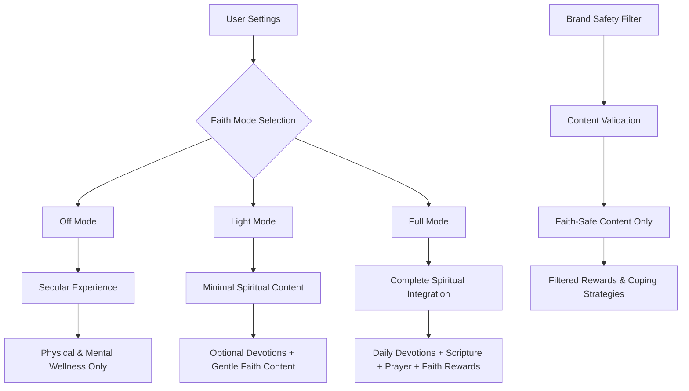
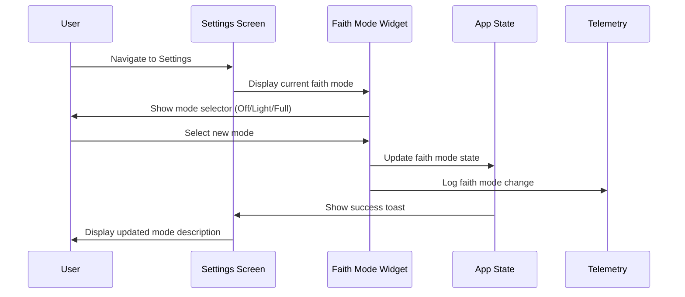
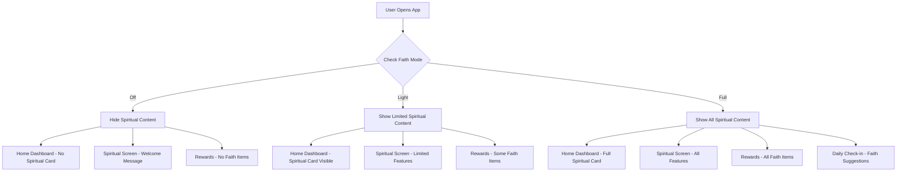

# Faith Mode System — Comprehensive Report

## Executive Summary

The UR4MORE Wellness app implements a sophisticated faith mode system that allows users to control the visibility and integration of spiritual content throughout the application. The system provides three distinct modes (Off, Light, Full) that progressively increase spiritual content exposure while maintaining brand safety and user choice.

**Core Philosophy:** Respectful, optional spiritual integration that enhances rather than dominates the wellness experience.

## Faith Mode Architecture



## Faith Mode Definitions

### Off Mode (Secular)
- **Purpose:** Complete secular experience focusing on physical and mental wellness
- **Content:** No spiritual content displayed anywhere in the app
- **Features Disabled:**
  - Spiritual Growth screen shows "Welcome Back" message with settings link
  - No faith-based coping strategies suggested
  - No spiritual rewards in marketplace
  - No faith-based completion suggestions
- **User Experience:** Clean, focused wellness journey without spiritual elements

### Light Mode (Minimal Faith)
- **Purpose:** Gentle spiritual integration with optional faith-based content
- **Content:** Minimal spiritual content with optional devotions and gentle encouragement
- **Features Enabled:**
  - Spiritual Growth screen accessible with limited content
  - Faith-based coping strategies available but not auto-selected
  - Some spiritual rewards visible in marketplace
  - Faith-based suggestions only when explicitly relevant
- **User Experience:** Balanced wellness journey with optional spiritual elements

### Full Mode (Complete Faith)
- **Purpose:** Complete spiritual integration with comprehensive faith-based wellness content
- **Content:** Full spiritual integration with daily devotions, scripture references, and faith-based wellness content
- **Features Enabled:**
  - Complete Spiritual Growth screen with all features
  - Auto-suggestion of faith-based coping strategies for high urges
  - Full access to spiritual rewards and content
  - Faith-based completion suggestions and peace verses
- **User Experience:** Holistic wellness journey integrating physical, mental, and spiritual growth

## Implementation Details

### Core Configuration (`lib/core/brand_rules.dart`)

**Faith Mode Enum:**
```dart
enum FaithMode { off, light, full }

FaithMode parseFaith(String? v) => switch (v) {
  'Light' => FaithMode.light,
  'Full' => FaithMode.full,
  _ => FaithMode.off,
};

String faithModeToString(FaithMode mode) => switch (mode) {
  FaithMode.light => 'Light',
  FaithMode.full => 'Full',
  FaithMode.off => 'Off',
};
```

**Brand Safety System:**
```dart
bool isFaithSafe(String s) {
  final t = s.toLowerCase();
  const banned = ['yoga', 'chakra', 'mantra', 'tarot', 'astrology', 'namaste'];
  return !banned.any(t.contains);
}

class BrandRules {
  static const List<String> bannedWords = [
    'yoga', 'chakra', 'mantra', 'tarot', 'astrology', 'namaste'
  ];
  
  static bool isContentSafe(String content) => isFaithSafe(content);
  static bool isRewardSafe(String title, String payload) => 
    isFaithSafe(title) && isFaithSafe(payload);
  static String sanitizeContent(String content) => 
    isContentSafe(content) ? content : '';
}
```

### Settings Interface (`lib/presentation/settings_profile_screen/`)

**Faith Mode Selector Widget:**
- **Location:** `widgets/faith_mode_section_widget.dart`
- **UI Pattern:** Three-option toggle with animated selection
- **Feedback:** Real-time mode descriptions and success toasts
- **Persistence:** Updates user data and syncs across app

**Mode Descriptions:**
- **Off:** "No spiritual content will be shown. Focus on physical and mental wellness only."
- **Light:** "Minimal spiritual content with optional devotions and gentle faith-based encouragement."
- **Full:** "Complete spiritual integration with daily devotions, scripture references, and faith-based wellness content."

### Content Filtering & Display

#### Home Dashboard (`lib/presentation/home_dashboard/`)

**Spiritual Content Visibility:**
```dart
bool _shouldShowSpiritualContent() {
  final faithMode = userData["faithMode"] as String?;
  return faithMode == "Light" || faithMode == "Full";
}

// Filters wellness cards to hide spiritual growth when faith mode is Off
List<Widget> _buildWellnessCards(BuildContext context) {
  return (wellnessActivities as List).where((activity) {
    if ((activity as Map<String, dynamic>)["id"] == "spiritual_growth") {
      return _shouldShowSpiritualContent();
    }
    return true;
  }).map((activity) => WellnessNavigationCard(...)).toList();
}
```

#### Spiritual Growth Screen (`lib/presentation/spiritual_growth_screen/`)

**Mode-Based Content Display:**
```dart
Widget build(BuildContext context) {
  return _faithMode == "Off" 
    ? _buildOffModeContent(context, colorScheme)
    : _buildActiveContent(context, colorScheme);
}

Widget _buildOffModeContent(BuildContext context, ColorScheme colorScheme) {
  return SafeArea(
    child: SingleChildScrollView(
      child: Column([
        FaithModeBannerWidget(faithMode: _faithMode),
        _buildWelcomeBackMessage(context, colorScheme),
      ])
    )
  );
}
```

**Faith Mode Banner Widget:**
- **Off Mode:** Shows "Spiritual Content Disabled" with settings link
- **Active Modes:** Shows current mode status with quick settings access
- **Visual Design:** Color-coded banners (gray for off, light blue for light, primary for full)

#### Daily Check-In Integration (`lib/presentation/daily_check_in_screen/`)

**Faith-Based Coping Strategy Auto-Selection:**
```dart
// In UrgeIntensityWidget - auto-select faith-based strategies for high urges
if (level >= 7 && _faithMode != FaithMode.off) {
  if (!_selectedCopingMechanisms.contains('scripture')) {
    _selectedCopingMechanisms.add('scripture');
  }
  if (!_selectedCopingMechanisms.contains('breathing')) {
    _selectedCopingMechanisms.add('breathing');
  }
}
```

**Faith-Based Completion Suggestions:**
```dart
void _showCompletionSummary(int pointsEarned) {
  String? suggestionTitle;
  String? suggestionAction;
  
  if (_painLevel > 0) {
    suggestionTitle = "Start Mobility Reset (5 min)";
    suggestionAction = "mobility_reset";
  } else if (_urgeLevel >= 7 && _faithMode != FaithMode.off) {
    suggestionTitle = "Open Peace Verse (30 sec)";
    suggestionAction = "peace_verse";
  }
  // Show modal with faith-based suggestions when appropriate
}
```

**Coping Strategies Faith Integration:**
- **Faith-Based Options:** 'read_scripture', 'pray' included in coping strategies
- **Auto-Selection:** Scripture and breathing suggested for high urges when faith mode enabled
- **Points System:** All coping strategies award +5 points regardless of faith content

#### Rewards Marketplace (`lib/presentation/rewards_marketplace_screen/`)

**Faith-Safe Content Filtering:**
```dart
void _applyRewardsFilter() {
  setState(() {
    _filteredRewards = _allRewards.where((reward) {
      final isUR4MORE = reward['is_ur4more'] == true;
      final isAllowed = reward['is_allowed'] == true;
      final isFaithSafe = BrandRules.isRewardSafe(
        reward['name'] as String,
        reward['description'] as String,
      );
      
      return isUR4MORE && isAllowed && isFaithSafe;
    }).toList();
  });
}
```

**Faith-Based Rewards:**
- **Devotional eBook:** "365 days of inspiring devotionals focused on wellness, faith, and personal growth"
- **Requirements:** "Faith mode must be enabled to access"
- **Filtering:** Automatically hidden when faith mode is Off

## User Experience Flows

### Faith Mode Selection Flow



### Spiritual Content Access Flow



## Content Safety & Brand Protection

### Prohibited Content Filtering

**Banned Terms:** The system actively filters out content containing:
- 'yoga', 'chakra', 'mantra', 'tarot', 'astrology', 'namaste'

**Implementation:**
```dart
// Applied to all user-generated content and rewards
static bool isContentSafe(String content) {
  return isFaithSafe(content);
}

static String sanitizeContent(String content) {
  if (!isContentSafe(content)) {
    debugPrint('Content filtered for brand safety: $content');
    return '';
  }
  return content;
}
```

### Faith-Safe Coping Strategies

**All Coping Strategies are Faith-Safe:**
- Read Scripture, Physical Exercise, Journaling, Listen to Music
- Call a Friend, Take a Walk, Practice Gratitude, Creative Activity
- Mindful Eating, Cold Shower, Deep Breathing, Pray

**No Prohibited Content:** All strategies avoid banned terms and focus on universally acceptable wellness practices.

## Analytics & Telemetry

### Faith Mode Tracking (`lib/core/services/telemetry.dart`)

**Faith Mode Change Events:**
```dart
static void faithModeChanged(String userId, String newMode, String previousMode) {
  logEvent('faith_mode_changed', {
    'user_id': userId,
    'new_mode': newMode,
    'previous_mode': previousMode,
    'timestamp': DateTime.now().toIso8601String(),
  });
}
```

**Usage Analytics:**
- Faith mode selection changes
- Spiritual content engagement rates
- Faith-based reward redemption patterns
- Coping strategy selection by faith mode

## Technical Implementation

### State Management

**Local State:** Each screen manages faith mode through local state variables
**Persistence:** Faith mode setting stored in user preferences/database
**Propagation:** Changes immediately affect all relevant screens

### Error Handling

**Graceful Degradation:** App functions normally even if faith mode data is missing
**Default Behavior:** Falls back to Off mode if faith mode is undefined
**Content Safety:** All content filtered through brand safety system

### Performance Considerations

**Efficient Filtering:** Content filtering happens at data source level
**Lazy Loading:** Spiritual content only loads when faith mode allows
**Caching:** Faith mode setting cached to avoid repeated lookups

## Known Limitations & Gaps

### Missing Features

1. **No Faith Mode Persistence:** Current implementation uses mock data
2. **No Cross-Screen State Sync:** Faith mode changes don't immediately update all screens
3. **Limited Faith Content:** Only basic devotional content available
4. **No Faith Mode Analytics:** Limited tracking of faith mode usage patterns

### Technical Debt

1. **Duplicate Faith Mode Enums:** Defined in multiple files
2. **Inconsistent String/Enum Usage:** Mix of string and enum representations
3. **Hardcoded Faith Mode Checks:** Scattered throughout codebase
4. **No Centralized Faith Mode Service:** Each screen manages independently

### User Experience Issues

1. **No Faith Mode Preview:** Users can't preview content before switching modes
2. **Abrupt Content Changes:** Switching modes immediately hides/shows content
3. **No Faith Mode Education:** Limited explanation of what each mode provides
4. **No Gradual Onboarding:** No progressive introduction to faith features

## Recommendations

### Immediate Improvements

1. **Centralize Faith Mode Management:**
   ```dart
   class FaithModeService {
     static FaithMode _currentMode = FaithMode.off;
     static Stream<FaithMode> get modeStream => _modeController.stream;
     
     static void setMode(FaithMode mode) {
       _currentMode = mode;
       _modeController.add(mode);
       _persistMode(mode);
     }
   }
   ```

2. **Implement Faith Mode Persistence:**
   - Store in SharedPreferences or database
   - Sync across app sessions
   - Handle offline/online scenarios

3. **Add Faith Mode Preview:**
   - Show content preview before switching
   - Explain what each mode enables/disables
   - Provide guided tour for new users

### Long-Term Enhancements

1. **Progressive Faith Integration:**
   - Gradual introduction of faith features
   - Optional faith mode onboarding
   - Personalized faith content recommendations

2. **Enhanced Faith Content:**
   - Daily devotional library
   - Prayer request system
   - Faith-based wellness challenges
   - Scripture-based meditation guides

3. **Advanced Analytics:**
   - Faith mode adoption rates
   - Content engagement by mode
   - User journey analysis
   - A/B testing for faith features

4. **Content Management System:**
   - Admin interface for faith content
   - Dynamic content filtering
   - User-generated faith content moderation
   - Seasonal faith content campaigns

### Technical Architecture Improvements

1. **Unified Faith Mode Service:**
   ```dart
   abstract class FaithModeService {
     static FaithMode get currentMode;
     static Stream<FaithMode> get modeChanges;
     static Future<void> setMode(FaithMode mode);
     static bool shouldShowSpiritualContent();
     static bool shouldShowFaithRewards();
     static List<String> getAvailableCopingStrategies();
   }
   ```

2. **Content Filtering Pipeline:**
   ```dart
   class ContentFilter {
     static List<T> filterByFaithMode<T>(
       List<T> content, 
       FaithMode mode,
       T Function(T) faithChecker
     ) {
       return content.where((item) => 
         _isContentAppropriateForMode(item, mode, faithChecker)
       ).toList();
     }
   }
   ```

3. **Faith Mode Configuration:**
   ```dart
   class FaithModeConfig {
     static const Map<FaithMode, FaithModeSettings> settings = {
       FaithMode.off: FaithModeSettings(
         showSpiritualScreen: false,
         showFaithRewards: false,
         enableFaithSuggestions: false,
         availableCopingStrategies: secularStrategies,
       ),
       FaithMode.light: FaithModeSettings(
         showSpiritualScreen: true,
         showFaithRewards: true,
         enableFaithSuggestions: false,
         availableCopingStrategies: allStrategies,
       ),
       FaithMode.full: FaithModeSettings(
         showSpiritualScreen: true,
         showFaithRewards: true,
         enableFaithSuggestions: true,
         availableCopingStrategies: allStrategies,
       ),
     };
   }
   ```

## Testing Strategy

### Unit Tests

1. **Faith Mode Logic:**
   ```dart
   test('should show spiritual content only when faith mode is Light or Full', () {
     expect(shouldShowSpiritualContent(FaithMode.off), false);
     expect(shouldShowSpiritualContent(FaithMode.light), true);
     expect(shouldShowSpiritualContent(FaithMode.full), true);
   });
   ```

2. **Content Filtering:**
   ```dart
   test('should filter faith-unsafe content', () {
     expect(BrandRules.isContentSafe('yoga meditation'), false);
     expect(BrandRules.isContentSafe('deep breathing'), true);
   });
   ```

### Integration Tests

1. **Faith Mode Switching:**
   - Test immediate UI updates
   - Verify content visibility changes
   - Check analytics events

2. **Cross-Screen Consistency:**
   - Verify faith mode state across all screens
   - Test navigation with different faith modes
   - Validate reward filtering

### User Acceptance Tests

1. **Faith Mode Selection:**
   - Easy mode switching in settings
   - Clear mode descriptions
   - Immediate feedback

2. **Content Appropriateness:**
   - No prohibited content in any mode
   - Appropriate content for each mode
   - Smooth transitions between modes

---

**Report Generated:** $(date)  
**Codebase Version:** Current branch `chore/refactor-ui-tokens`  
**Total Files Analyzed:** 15 files across faith mode system  
**Key Components:** Brand rules, settings, spiritual growth, daily check-in, rewards marketplace


